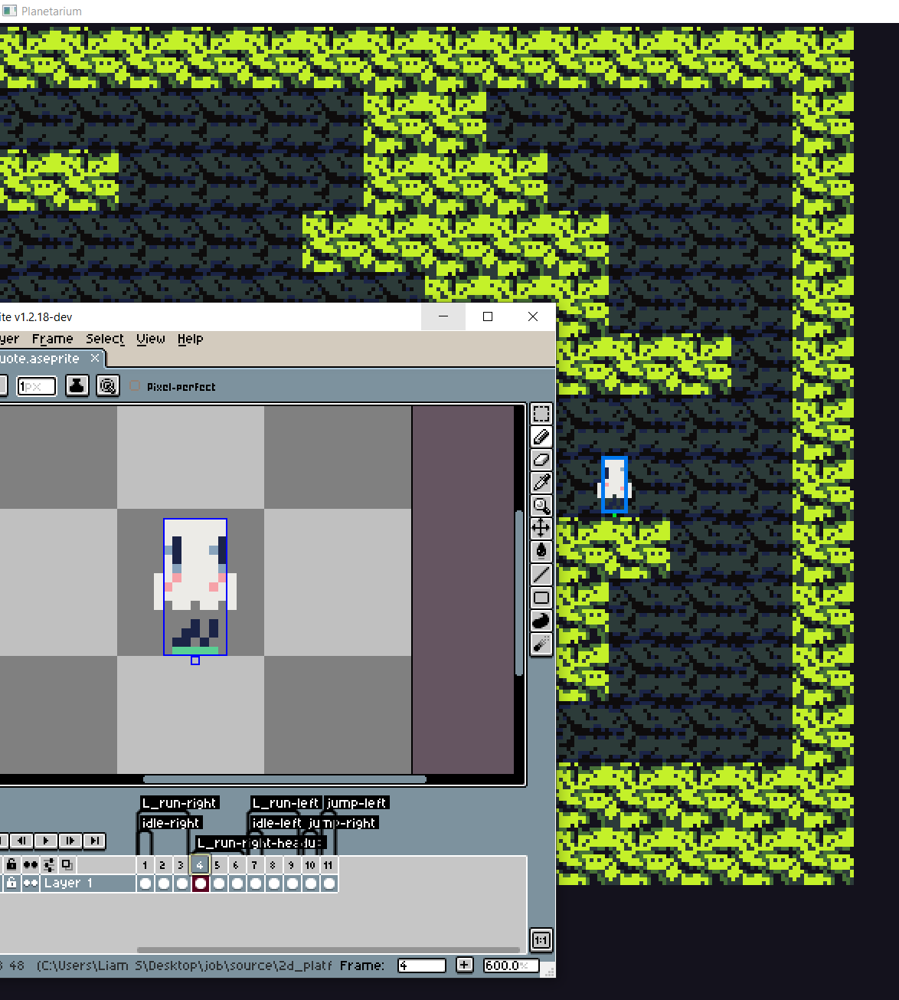

C 2D platformer engine

[Source code](source/2d_platformer/planetarium-project-snippet-for-showcasing/src)

I made this 2D platformer game engine in C.
Its modularly programmed so that tooling is easy. The asset pipeline is seamlessly integrated with Aseprite (a popular pixel art animation software). The program is structured in a way that is easy to expand into a full game. For this project I decided to use Raylib instead of OpenGL so I could get straight to rendering quads to the screen.

I want to program and release a full length 2D story/platforming game in this way eventually since I love 2D indie games.

### Level creation and serialisation

Serialisation uses JSON and I kept it simple and clean.

I also made sure to get the character controller feeling good, including ground friction, air resistance, coyote time, varying jump height by how long you hold the jump button. I set these parameters to give tight feeling control of the player character.


I store the tilemap data, and a list of entities.
Here I've added lots of player entities for fun:

```json
{
	"world_position": { "x": 0, "y": 0 },
	"tilemap": {
		"tileset_name": "tileset_underground",
		"rows":	14,
		"columns":	16,
		"ground":	[1, 1, 1, 1, 1, 1, 1, 1, 1, 1, 1, 1, 1, 1, 1, 0, 0, 0, 0, 0, 0, 0, 0, 0, 0, 0, 1, 1, 1, 0, 1, 0, 0, 1, 0, 0, 0, 0, 0, 0, 1, 1, 1, 0, 1, 0, 0, 0, 0, 0, 0, 0, 1, 0, 1, 1, 1, 0, 0, 0, 0, 0, 0, 0, 0, 0, 1, 1, 1, 1, 1, 0, 0, 0, 0, 0, 1, 1, 1, 0, 0, 0, 1, 1, 1, 0, 0, 0, 0, 0, 0, 0, 1, 0, 0, 1, 1, 1, 1, 0, 0, 1, 0, 0, 0, 0, 0, 0, 0, 0, 1, 1, 1, 1, 1, 1, 0, 0, 0, 0, 0, 0, 0, 0, 1, 1, 1, 1, 1, 1, 1, 0, 0, 0, 0, 0, 0, 0, 1, 1, 1, 0, 1, 1, 1, 1, 1, 0, 0, 0, 1, 1, 1, 1, 1, 0, 0, 1, 1, 1, 0, 0, 1, 1, 1, 0, 1, 1, 1, 0, 0, 0, 0, 1, 0, 0, 1, 0, 0, 0, 1, 1, 1, 0, 0, 0, 0, 1, 0, 0, 0, 0, 0, 0, 1, 1, 1, 0, 0, 0, 0, 0, 0, 0, 0, 0, 0, 0, 1, 1, 1, 1, 1, 1, 1, 1, 1, 1, 1, 1, 1, 1, 1, 1],
		"bg":	[2, 2, 2, 2, 2, 2, 2, 2, 2, 2, 2, 2, 2, 2, 2, 2, 2, 2, 2, 2, 2, 2, 2, 2, 2, 2, 2, 2, 2, 2, 2, 2, 2, 2, 2, 2, 2, 2, 2, 2, 2, 2, 2, 2, 2, 2, 2, 2, 2, 2, 2, 2, 2, 2, 2, 2, 2, 2, 2, 2, 2, 2, 2, 2, 2, 2, 2, 2, 2, 2, 2, 2, 2, 2, 2, 2, 2, 2, 2, 2, 2, 2, 2, 2, 2, 2, 2, 2, 2, 2, 2, 2, 2, 2, 2, 2, 2, 2, 2, 2, 2, 2, 2, 2, 2, 2, 2, 2, 2, 2, 2, 2, 2, 2, 2, 2, 2, 2, 2, 2, 2, 2, 2, 2, 2, 2, 2, 2, 2, 2, 2, 2, 2, 2, 2, 2, 2, 2, 2, 2, 2, 2, 2, 2, 2, 2, 2, 2, 2, 2, 2, 2, 2, 2, 2, 2, 2, 2, 2, 2, 2, 2, 2, 2, 2, 2, 2, 2, 2, 2, 2, 2, 2, 2, 2, 2, 2, 2, 2, 2, 2, 2, 2, 2, 2, 2, 2, 2, 2, 2, 2, 2, 2, 2, 2, 2, 2, 2, 2, 2, 2, 2, 2, 2, 2, 2, 2, 2, 2, 2, 2, 2, 2, 2, 2, 2, 2, 2, 2, 2, 2, 2, 2, 2]
	},
	"entities": [
		{
			"spawn_point": { "x": 128, "y": 128 },
			"type": "player"
		},
		{
			"spawn_point": { "x": 100, "y": 64 },
			"type": "player"
		},
		{
			"spawn_point": { "x": 50, "y": 128 },
			"type": "player"
		},
		{
			"spawn_point": { "x": 55, "y": 64 },
			"type": "player"
		},
		{
			"spawn_point": { "x": 60, "y": 128 },
			"type": "player"
		},
		{
			"spawn_point": { "x": 70, "y": 64 },
			"type": "player"
		}
	]
}
```

I needed to make a simple editor for creating the tile maps:


### Sprite system loading Aseprite files


```c
typedef struct Sprite_Animation
{
    char* name;
    int from;
    int to;
    int loop;
    float total_duration;
}
Sprite_Animation;

typedef struct Sprite
{
    Texture2D spritesheet;
    int width;  // width of individual sprite, not the spritesheet
    int height;

    int frame_count;
    float* frame_durations;

    int animation_count;
    Sprite_Animation* animations;

    Rectangle collision_box;
    Vector2 pivot;  // relative to top-left corner 
}
Sprite;

typedef struct Sprite_State
{
    int current_animation;
    int current_frame;
    float current_animation_time;
}
Sprite_State;

int load_sprite(const char* aseprite_path, Sprite* out);
void unload_sprite(Sprite* sprite);
Texture2D load_texture_aseprite(const char* aseprite_path);
int begin_sprite_animation(Sprite* sprite, Sprite_State* state, char* name);
int begin_or_continue_sprite_animation(Sprite* sprite, Sprite_State* state, char* name);
void update_sprite(Sprite* sprite, Sprite_State* state, float dt);
void draw_sprite(Sprite* sprite, Sprite_State state, Vector2 pos);
void draw_sprite_collision(Sprite* sprite, Vector2 pos);

```

Entities can have a sprite state component which handles all there sprite updates in a very easy way.

Directly loads the following data from Aseprite files:
- Animation names (Prefix name with 'L_' for my program to recognise it as a looping animation)
- How long each individual frame lasts
- Collision box setting through Aseprite's slices feature
- Setting pivot (origin) of sprite



### Easy to work with entity system

For a low memory overhead 2D game, each entity can be stored as a bunch of components, only using the relevant fields for that entity type:
```c
typedef struct Entity
{
    Vector2 position;
    int type;
    Room* parent_room;

    // Bools:
    unsigned char has_sprite;
    unsigned char has_mover;
    unsigned char has_player;

    // Components:
    Component_Sprite  sprite;
    Component_Mover   mover;
    Component_Player  player;
}
Entity;
```
Currently implemented components are:
- Sprite component, for the state of the current animation
- Mover component, to give an entity collision with the tilemap and other mover entities.
- Player component, for the player entity specifically to be moved around with the keyboard.

Entities work well together by default through this system, I'm definitely going to reuse this system in future projects.
```c
void
create_entity(Room* parent_room, Vector2 position, int type, Entity* out_e)
{
    ++parent_room->entity_count;
    out_e->position = position;
    out_e->parent_room = parent_room;
    out_e->type = type;
    switch (type)
    {
        case ENTITY_PLAYER:
            entity_init_as_player(out_e);
            break;
    }
}

void
update_entity(Entity* e, float dt)
{
    if (e->has_player)  component_player_update(e, dt);
    if (e->has_mover)   component_mover_update(e, dt);
    if (e->has_sprite)  component_sprite_update(e, dt);
}

void
draw_entity(Entity* e)
{
    if (e->has_player)  component_player_render(e);
    if (e->has_sprite)  component_sprite_render(e);
    if (e->has_mover)   component_mover_render(e);
}
```


