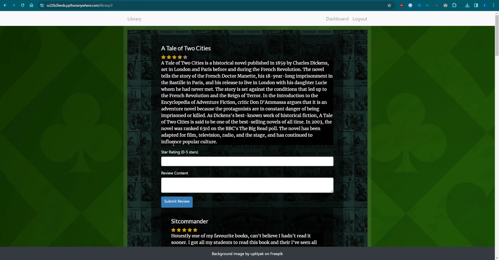

# My Projects
**Liam Swarbrick**  
<!-- _Looking for a summer internship / summer job_ -->

I am currently in my fourth year at the University of Leeds completing the last year of my **MEng/BSc in Computer Science with High Performance Computer Graphics and Games Engineering**.

<!-- I'm actively developing my thesis project **"Integrating Linearly-Transformed Cosine based Area Lights into a Clustered Forward Renderer"**. [(Progress update below.)](#thesis-integrating-linearly-transformed-cosine-based-area-lights-into-a-clustered-forward-renderer-progress-update) -->

Here are some of my projects; my main focus currently is on real time rendering and game/engine programming.

<details>
<summary><strong>My Projects - Table of Contents </strong></summary>

- [My Projects](#my-projects)
  - [Scalable Real-Time Polygonal Area Lighting (My BSc Thesis \& Custom glTF2 Renderer) (2024/25)](#scalable-real-time-polygonal-area-lighting-my-bsc-thesis--custom-gltf2-renderer-202425)
      - [Future Research](#future-research)
      - [Progress screenshots of early versions during the development of the renderer:](#progress-screenshots-of-early-versions-during-the-development-of-the-renderer)
  - [2D Platformer Engine in C with Raylib (2023)](#2d-platformer-engine-in-c-with-raylib-2023)
  - [Voxel Game in C with OpenGL 4.5 from scratch on the Win32API (2022)](#voxel-game-in-c-with-opengl-45-from-scratch-on-the-win32api-2022)
  - [Compiler for Java-like language 'Jack' written in C (2024)](#compiler-for-java-like-language-jack-written-in-c-2024)
  - [Godot-Wild Game-Jam Winner: My Precision Platformer for the theme "One Control" (2019)](#godot-wild-game-jam-winner-my-precision-platformer-for-the-theme-one-control-2019)
  - [Library Website in Python-Flask (2023)](#library-website-in-python-flask-2023)
  - [My Godot game that ran on the Nintendo Switch (2019)](#my-godot-game-that-ran-on-the-nintendo-switch-2019)
  - [Snippet of my older unfinished but of interest projects](#snippet-of-my-older-unfinished-but-of-interest-projects)
    - [Dual-Quaternion vertex skinning implementation I couldn't render (2020)](#dual-quaternion-vertex-skinning-implementation-i-couldnt-render-2020)
    - [Unfinished C Game-Boy Emulator (2019)](#unfinished-c-game-boy-emulator-2019)
    - [C# Game drop-down console (2018)](#c-game-drop-down-console-2018)
    - [Other Games and Projects (2016-2018)](#other-games-and-projects-2016-2018)
      - [My old released games on Itch: https://liam-swarbrick.itch.io/ (Creator Page) or https://itch.io/profile/liam-swarbrick (Profile)](#my-old-released-games-on-itch-httpsliam-swarbrickitchio-creator-page-or-httpsitchioprofileliam-swarbrick-profile)

</details>

## Scalable Real-Time Polygonal Area Lighting (My BSc Thesis & Custom glTF2 Renderer) (2024/25)
**"Endless Cinematic Area Lighting: Scalable Real-Time LTC Polygonal Lights with Clustered Forward Shading"**


_Software Delivered:_ Custom OpenGL 4.6 glTF2.0 Physically-Based scene renderer in C that supports thousands of polygonal area lights in real-time.

_Development Time: November 2024 - April 2025_

This project explores scalable real-time rendering of polygonal area lights using Linearly Transformed Cosines (LTCs) in a clustered forward shading pipeline. While LTCs make physically based polygonal lights efficient, they can only be used very sparingly in real-time applications, as they scale poorly with many light sources due to high computational cost per area light.

To address this, the system I developed performs both spatial and normal-space clustering for aggressive and accurate light culling. Unlike previous work where normal cones were too costly, this method demonstrates that they significantly improve performance for polygonal lights --- retaining distant specular reflections while supporting thousands of lights at interactive frame rates.

The system is implemented in a custom glTF 2.0 Physically Based Renderer that I made from scratch during the project. It's written in C with OpenGL 4.6 for Windows and Linux.

See below for a demo video of the renderer with 2000 polygonal lights across multiple instances of the UE4 Sun Temple model to see the scalability in large environments.

Read: [📄report/thesis](https://github.com/LiamSwarbrick/LTCClustered-ManyAreaLights/blob/main/report-postsubmission-fixed-clustered_arealights_thesis.pdf) - [📄source code](https://github.com/LiamSwarbrick/LTCClustered-ManyAreaLights)  
Demo video of 2000 Area Lights in 606,000 triangle scene (Diffuse Bounds): [YouTube](https://youtu.be/hqbCelGbMRc?si=f3NnEI9hrKSv9t3w)  
Demo walkthrough of Light Cones for efficient specular in NormalxPosition Clustered Shading: [YouTube](https://youtu.be/m9sKT003kLM?si=JkejAa6j87bZ9MaZ)  

<!-- 📄 [Read my thesis](https://github.com/LiamSwarbrick/LTCClustered-ManyAreaLights/blob/main/report-postsubmission-fixed-clustered_arealights_thesis.pdf)   -->
<!-- 💻 [Peruse the source code](https://github.com/LiamSwarbrick/LTCClustered-ManyAreaLights)   -->
<!-- 🎥 [See a demo video](https://youtu.be/hqbCelGbMRc?si=f3NnEI9hrKSv9t3w) -->

#### Future Research
If time allows, this project's is set to be developed further to get to an industrial standard, for instance, light assignment can be speedup massively using sparse clustering, and redeveloping the light assignment approach more soundly should make the algorithm more precise and avoid any edge cases as industry frowns upon edge cases greatly. 

<!--  -->
 


 

#### Progress screenshots of early versions during the development of the renderer:
   
   


<!-- For my year project I developed a scalable area lighting technique for Clustered (forward) renderers to render thousands of LTC-based polygonal area-lights in real-time. I focused on maintaining accurate long range specular culling and tight diffuse culling.
The approach assigns area lights to both spatial and normal (directional) clusters each frame using compute shaders.

[read my thesis here](https://github.com/LiamSwarbrick/LTCClustered-ManyAreaLights/blob/main/report-postsubmission-fixed-clustered_arealights_thesis.pdf)

### Custom Rendering Engine: A glTF 2.0 Physically-Based Renderer in C and OpenGL 4.6

Along with this report, I implemented the proposed system in a custom glTF 2.0 Physically Based Rendering (PBR) engine, developed in C with the OpenGL 4.6 graphics API for Windows and Linux. glTF 2.0 is a modern 3D scene file format designed for PBR pipelines and modern graphics APIs.

[_source code here (github)_](https://github.com/LiamSwarbrick/LTCClustered-ManyAreaLights)

The video below showcases the system in a scene composed of 2000 polygonal lights and sixteen instances of the UE4 Sun Temple model, arranged in a grid to emulate a more expansive environment.

[](https://youtu.be/hqbCelGbMRc?si=f3NnEI9hrKSv9t3w) -->
<!--  -->

<!-- 
## Thesis Progress: "Integrating Linearly-Transformed Cosine Based Area Lights into a Clustered Forward Renderer"

This November 2024, I began my thesis project **"Integrating Linearly-Transformed Cosine Based Area Lights into a Clustered Forward Renderer"**. I'm developing a custom OpenGL 4.6 renderer in C. Below is a snapshot of my progress so far:

<!--   -->
<!-- 

<!--  -->
<!-- 

  
   -->
<!-- 
#### Features of My OpenGL 4.6 C Renderer:
- **Custom glTF Physically-Based Renderer**:
  Full PBR support including dynamic lights, emissive textures, occlusion maps, normal mapping, and alpha blending with depth sorting.

- **Culled Linearly Transformed Cosine based Area lights**:
  - Physically based rendering of area light as per Heitz. et al. that supports any non-convex polygon by transforming the closed-form lambertian (perfect diffuse shading) integral over spherical polygons with linear transformation to retrieve features of more accurate physically based lighting models.

- **Novel Area Light Culling with Clustered Shading**:
  - First compute shader divides the view space into voxel clusters and then another compute shader performs bruteforce light assignment to clusters.
  - Makes it feasible to use many dynamic area lights throughout a scene in real-time without needing a good graphics card. It does this by keeping the number of light computations each pixel performs to a minimum ($\le$ the max number of overlapping area lights). -->
<!-- 
#### Ongoing Work:
- Report write-up.
- Improving light assignment to better better handle strongly specular materials in clustered shading. Since specular light has huge radius but narrow apperture.
- Maybe Order-Independent Transparency to handle glTF files with transparent objects batched into one draw call. -->

<!-- --- -->

<!-- --- -->

## 2D Platformer Engine in C with Raylib (2023)


<!--  -->


<!--  -->

- Custom sprite animation and asset system integrated with the Aseprite pixelart program for a simple fun asset pipeline.
- Integrated tilemap editor, serialising levels with json.

At some point I want to create a full length 2D story/platforming game this way to release on Steam since I love 2D indie games.

[Link to the markdown page to read about it](2d_c_engine.md) **<-**
- [Level creation and serialisation](2d_c_engine.md#level-creation-and-serialisation)
- [Sprite system loading Aseprite files](2d_c_engine.md#sprite-system-loading-aseprite-files)
- [Easy to work with entity system](2d_c_engine.md#easy-to-work-with-entity-system)


## Voxel Game in C with OpenGL 4.5 from scratch on the Win32API (2022)


Voxel rendering with 3D chunking, texture arrays and mesh-culling optimisations.
My 3D chunk storage allows infinite height worlds which opens up more interesting world generation possibilities - sky islands, planets, deep sea trenches, the possibilities are endless.
At some point I'd like to explore this project more fully, e.g. a faster chunk hashing system, and unique world generation with the unlimited height axis.

[Click here](source/c_blockgame_september_snippet/src) to peruse the source code if you also like some C programming.

Programmed so that the Windows API layer is straight forward to swap with a cross-platform library for Linux. Using no libraries was great for learning (hence not using GLFW). I implemented my own math library originally ([which you can see here](source/c_blockgame_september_snippet/old_custom_math_src/src_oldcustommath/include/basic_types.h)) but swapped it out for [cglm](https://github.com/recp/cglm) since I was short on time and needed to trust the mathematical correctness immediately when debugging rendering errors, rather than rushing through math functions without thorough testing.

RenderDoc and OpenGL 4.5's debugging API were very useful for GPU debugging, which I needed to do a lot of, especially for building and uploading the mesh data of each voxel chunk.


## Compiler for Java-like language 'Jack' written in C (2024)

This project was for a University coursework, written in C using recursive-descent and it passed all testing and edge cases, receiving max marks. The input is a folder of .jack source files and compiles to virtual machine code for the Hack computer.


## Godot-Wild Game-Jam Winner: My Precision Platformer for the theme "One Control" (2019)

For the theme of "One-Control", in just over a week I made an entry for the January 2019 [Godot-Wild Jam #5](https://itch.io/jam/godot-wild-jam-5/rate/358355)!

<!--  -->


My solo-entry was the result of 8-days of working in the Godot game engine (which has come a long way since 2019). I programmed a weighty one-control movement system, the physics feel responsive and precise as you build momentum. I had lots of fun drawing and animating the pixel art, and meticulously designed the levels perfectly around the mushroom player's movements, requiring skill and precision (taking up peoples afternoons to beat all the levels). I also had success with the sound design, respawn transitions, and adding fractal-brownian-motion fog for atmosphere.


The community behind this jam was really great and gave lots of lovely feedback! ([You can see it here on my entry page for the jam](https://itch.io/jam/godot-wild-jam-5/rate/358355))


## Library Website in Python-Flask (2023)

This project was for a University coursework. The site dynamically loads books from the server, has a secure log in system, book reviews and rating system, user's personal library.
The site is accessible, for instance in an accessibility pass the colours and contrasts were adjusted to be more colour-blind friendly, and the site passed checks with WAVE (A web accessability evaluation tool).

Users, Books, and Reviews are stored in a SQL database. [Here is the models python file for instance](source/library-site-source-snippet/app/models.py)




## My Godot game that ran on the Nintendo Switch (2019)

For the 100-hour long Extra Credits Game Jam #3 (Feb 2019), I made a grapple hook game in the Godot Engine. I went for a game-boy style colour restriction since it was faster to make the assets that way in such a short time-span.
_Since 2019 to the time of writing this, it should still be on [liamswarbrick.github.io](https://liamswarbrick.github.io), an updated version at least, which is slightly longer (but without the end screen) and slightly tighter controls than the original downloadable version._


The Godot engine founder Ariel Manzur emailed me asking if I'd like to see a build on the switch, I quickly added gamepad and touch screen controls and was overjoyed to see it running since the Switch felt so new, I don't recall even seeing one in person at that point, The touch-screen controls were janky on there since I of course couldn't test it before sending a build over.


<!-- ## C\# 2018, Game drop-down console with command processing


## C programming 2019
2019
- OpenGL testing phong shading-
- Unfinished skeletal animation programming (tried implementing a dual quaternion vertex skinning algorithm)
- Game boy emulator (never finished) -->

## Snippet of my older unfinished but of interest projects
I have many older and unfinished projects in all sorts of languages: Python, C#, Haxe, Rust etc. Here's some random examples...

### Dual-Quaternion vertex skinning implementation I couldn't render (2020)

For my A-Level Computer Science project I went for a far too challenging project for my 16 year old self but it helped me so much more in the years to come than any boring project I could've finished.

I wrote an OpenGL 4.5 renderer that could load obj files, and I wanted to try skeletal animation. Naively after learning about the basics, I went straight to trying to implemented a more advanced technique from [this paper](https://team.inria.fr/imagine/files/2014/10/skinning_dual_quaternions.pdf) "Skinning with Dual Quaternions" that used dual-quaternion transforms instead of matrices, and while I did learn a lot about skinning algorithms researching it. Once I had written a lot of C code for it (even doing premature optimisations like caching joint keyframes), I realised that I couldn't source assets with skeletal animations stored in such a format without writing a custom exporter for Blender. I now know better and would have just gone with the simpler algorithm until performance or rendering quality called for more.

See my implementation in the C header file [skeletal_animation.h](source/skrewrite-dual-quat-snippet/game/src/skeletal_animation.h) and the shader code [rigged_mesh_vertex_shader.glsl.](source/skrewrite-dual-quat-snippet/game/data/shaders/rigged_mesh_vertex_shader.glsl)


### Unfinished C Game-Boy Emulator (2019)

I was very interested in game console emulation, but never finished implementing all the instructions for the Game-Boy's processor. I'll definitely do some more emulator development in the future.


```c
typedef u8 MMU[0xFFFF];

// cpu (Sharp LR35902 core @ 4.19 MHz, similar to the Z80)
typedef struct CPU
{
    union { struct { u8 f; u8 a; }; u16 af; };  // A, F
    union { struct { u8 c; u8 b; }; u16 bc; };  // B, C
    union { struct { u8 e; u8 d; }; u16 de; };  // D, E
    union { struct { u8 l; u8 h; }; u16 hl; };  // H, L
    u16 pc;  // program counter
    u16 sp;  // stack pointer

    MMU mmu;  // MMU used to map virtual addresses with physical addresses

    u64 t_clock;  // every machine cycle takes exactly 4 T states
    u8 delta_t_clock;  // cycles for last instrution
    
    struct
    {
        u16 mode;
        u16 mode_clock;
        u16 line;  // current scanline
    } video;
}
CPU;
```

### C\# Game drop-down console (2018)

Made in C# and Raylib, command processing was implemented after this old video, intended to be used for game debugging.


### Other Games and Projects (2016-2018)

In these years I developed plenty of small games and programming projects in C#, Godot, and Python to name the most significant.
For my early days of programming I was making small games in Python, mostly 2D games using the pygame library, and also a basic cube renderer using OpenGL 1's fixed function pipeline.
In C# I started learning the basic of modern OpenGL, with hobby projects that included texture mapping and point lighting. I was also a fan of XNA games so I made a few very unfinished 2D games in MonoGame.

#### My old released games on Itch: https://liam-swarbrick.itch.io/ (Creator Page) or https://itch.io/profile/liam-swarbrick (Profile)
When I found the Godot engine, I became hooked for a while on engine based game development, joining many game jams, participating alot in game development communities and making many small but finished games that other would play and give feedback on via my itch io page.

Most of my old projects are lost to time, or aren't worth listing here, given they date to when I was just starting to teach myself to program as a teenager.
