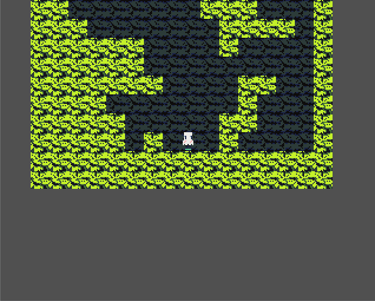

# My Projects
**Liam Swarbrick**  
_Looking for a summer internship / summer job_

I am currently in my third year at the **University of Leeds** studying a **MEng/BSc in Computer Science with High Performance Computer Graphics and Games Engineering**.

I'm actively developing my thesis project **"Integrating Linearly-Transformed Cosine based Area Lights into a Clustered Forward Renderer"**. [(Progress update below.)](#thesis-integrating-linearly-transformed-cosine-based-area-lights-into-a-clustered-forward-renderer-progress-update)

Here are some of my projects; I'm passionate about **computer graphics and games engineering**. After three summer harvests farming for plant breeders, I shan't photosynthesize any more and look forward to working in computers.

****
- [My Projects](#my-projects)
  - [Thesis "Integrating Linearly-Transformed Cosine based Area Lights into a Clustered Forward Renderer" Progress Update](#thesis-integrating-linearly-transformed-cosine-based-area-lights-into-a-clustered-forward-renderer-progress-update)
      - [DONE: Custom C OpenGL 4.6 glTF renderer. Implemented PBR-metallic-roughness BDRF (Bidirectional reflectance distribution function) and other PBR maps like normal mapping. Point Lights and Directional light.](#done-custom-c-opengl-46-gltf-renderer-implemented-pbr-metallic-roughness-bdrf-bidirectional-reflectance-distribution-function-and-other-pbr-maps-like-normal-mapping-point-lights-and-directional-light)
      - [Ongoing: Area lights. Clustered Shading. Area light assignment algorithm.](#ongoing-area-lights-clustered-shading-area-light-assignment-algorithm)
  - [Voxel Game in C with OpenGL 4.5 from scratch on the Win32API](#voxel-game-in-c-with-opengl-45-from-scratch-on-the-win32api)
  - [2D Platformer Engine in C with Raylib](#2d-platformer-engine-in-c-with-raylib)
  - [Compiler for Java-like language 'Jack' written in C](#compiler-for-java-like-language-jack-written-in-c)
  - [2019 Game-Jam Winner: My Precision Platformer for the theme "One Control"](#2019-game-jam-winner-my-precision-platformer-for-the-theme-one-control)
  - [Library Website in Python-Flask](#library-website-in-python-flask)
  - [My Godot game that ran on the Nintendo Switch](#my-godot-game-that-ran-on-the-nintendo-switch)
  - [Snippet of my older unfinished but of interest projects](#snippet-of-my-older-unfinished-but-of-interest-projects)
    - [Dual-Quaternion vertex skinning implementation I couldn't render (2020)](#dual-quaternion-vertex-skinning-implementation-i-couldnt-render-2020)
    - [Unfinished C Game-Boy Emulator (2019)](#unfinished-c-game-boy-emulator-2019)
    - [C# Game drop-down console (2018)](#c-game-drop-down-console-2018)


## Thesis "Integrating Linearly-Transformed Cosine based Area Lights into a Clustered Forward Renderer" Progress Update

This November I've begun my thesis project **"Integrating Linearly-Transformed Cosine based Area Lights into a Clustered Forward Renderer"**, I'm developing my own OpenGL 4.6 renderer for it in C and you can see my progress on my project so far below...

Area lights are physically-based polygonal lights, and I will design a way to assign them to spatial clusters in order to integrate clustered shading which will drastically reduce the large GPU throughput that comes from forward rendering lots of lights and thus render scenes with potentially thousands of these lights in real-time.

#### DONE: Custom C OpenGL 4.6 glTF renderer. Implemented PBR-metallic-roughness BDRF (Bidirectional reflectance distribution function) and other PBR maps like normal mapping. Point Lights and Directional light.

Output radiance is gamma-corrected to sRGB from linear color-space as it should be. Textures that represent color (base and emissive maps) are converted from sRGB to linear space on load with `GL_SRGB8_ALPHA8`.
Renderer also implements emissive textures, occlusion maps and normal maps.

<!--  -->
<!--  -->

<!--  -->
<!--  -->

An early version looked like...


#### Ongoing: Area lights. Clustered Shading. Area light assignment algorithm.

## Voxel Game in C with OpenGL 4.5 from scratch on the Win32API


Voxel rendering with 3D chunking, texture arrays and mesh-culling optimisations. My most recent project so it's at an early stage. I intend to add proper world generation, and need to add a faster chunk hashing system.

My 3D chunk storage allows infinite height worlds which opens up more interesting world generation possibilities - sky islands, planets, deep sea trenches, the possibilities are endless.

[Feel free to peruse the source code to my program here if you also like some C programming](source/c_blockgame_september_snippet/src)

Programmed so that the Windows API layer is straight forward to swap with a cross-platform library for Linux. Using no libraries was great for learning (hence not using GLFW). I implemented my own math library originally ([which you can see here](source/c_blockgame_september_snippet/old_custom_math_src/src_oldcustommath/include/basic_types.h)) but swapped it out for [cglm](https://github.com/recp/cglm) since I could trust its mathematical correctness when debugging rendering errors.

RenderDoc and OpenGL 4.5's debugging API were very useful for GPU debugging, which I needed to do a lot of, especially for building and uploading the mesh data of each voxel chunk.

## 2D Platformer Engine in C with Raylib


<!--  -->

- Custom sprite animation and asset system integrated with the Aseprite pixelart program for a simple fun asset pipeline.
- Integrated tilemap editor, serialising levels with json.

At some point I want to create a full length 2D story/platforming game this way to release on Steam since I love 2D indie games.

[Link to the markdown page to read about it](2d_c_engine.md) **<-**
- [Level creation and serialisation](2d_c_engine.md#level-creation-and-serialisation)
- [Sprite system loading Aseprite files](2d_c_engine.md#sprite-system-loading-aseprite-files)
- [Easy to work with entity system](2d_c_engine.md#easy-to-work-with-entity-system)

## Compiler for Java-like language 'Jack' written in C

This project was for a University coursework, written in C using recursive-descent and it passed all testing and edge cases, receiving max marks. The input is a folder of .jack source files and compiles to virtual machine code for the Hack computer.


## 2019 Game-Jam Winner: My Precision Platformer for the theme "One Control"

For the theme of "One-Control", in just over a week I made an entry for the January 2019 [Godot-Wild Jam #5](https://itch.io/jam/godot-wild-jam-5/rate/358355)!

<!--  -->


My solo-entry was the result of 8-days of working in the Godot game engine (which has come a long way since 2019). I programmed a weighty one-control movement system, the physics feel responsive and precise as you build momentum. I had lots of fun drawing and animating the pixel art, and meticulously designed the levels perfectly around the mushroom player's movements, requiring skill and precision (taking up peoples afternoons to beat all the levels). I also had success with the sound design, respawn transitions, and adding fractal-brownian-motion fog for atmosphere.


The community behind this jam was really great and gave lots of lovely feedback! ([You can see it here on my entry page for the jam](https://itch.io/jam/godot-wild-jam-5/rate/358355))


## Library Website in Python-Flask

This project was for a University coursework. The site dynamically loads books from the server, has a secure log in system, book reviews and rating system, user's personal library.
The site is accessible, for instance in an accessibility pass the colours and contrasts were adjusted to be more colour-blind friendly, and the site passed checks with WAVE (A web accessability evaluation tool).

Users, Books, and Reviews are stored in a SQL database. [Here is the models python file for instance](source/library-site-source-snippet/app/models.py)


## My Godot game that ran on the Nintendo Switch

For the 100-hour long Extra Credits Game Jam #3 (Feb 2019), I made a grapple hook game in the Godot Engine. I went for a game-boy style colour restriction since it was faster to make the assets that way in such a short time-span.
_Since 2019 to the time of writing this, it should still be on [liamswarbrick.github.io](https://liamswarbrick.github.io), an updated version at least, which is slightly longer (but without the end screen) and slightly tighter controls than the original downloadable version._


The Godot engine founder Ariel Manzur emailed me asking if I'd like to see a build on the switch, I quickly added gamepad and touch screen controls and was overjoyed to see it running since the Switch felt so new, I don't recall even seeing one in person at that point, The touch-screen controls were janky on there since I of course couldn't test it before sending a build over.


<!-- ## C\# 2018, Game drop-down console with command processing


## C programming 2019
2019
- OpenGL testing phong shading-
- Unfinished skeletal animation programming (tried implementing a dual quaternion vertex skinning algorithm)
- Game boy emulator (never finished) -->

## Snippet of my older unfinished but of interest projects
I have many older and unfinished projects in all sorts of languages: Python, C#, Haxe, Rust etc. Here's some random examples...

### Dual-Quaternion vertex skinning implementation I couldn't render (2020)

For my A-Level Computer Science project I went for a far too challenging project for my 16 year old self but it helped me so much more in the years to come than any boring project I could've finished.

I wrote an OpenGL 4.5 renderer that could load obj files, and I wanted to try skeletal animation. Naively after learning about the basics, I went straight to trying to implemented a more advanced technique from [this paper](https://team.inria.fr/imagine/files/2014/10/skinning_dual_quaternions.pdf) "Skinning with Dual Quaternions" that used dual-quaternion transforms instead of matrices, and while I did learn a lot about skinning algorithms researching it. Once I had written a lot of C code for it (even doing premature optimisations like caching joint keyframes), I realised that I couldn't source assets with skeletal animations stored in such a format without writing a custom exporter for Blender. I now know better and would have just gone with the simpler algorithm until performance or rendering quality called for more.

See my implementation in the C header file [skeletal_animation.h](source/skrewrite-dual-quat-snippet/game/src/skeletal_animation.h) and the shader code [rigged_mesh_vertex_shader.glsl.](source/skrewrite-dual-quat-snippet/game/data/shaders/rigged_mesh_vertex_shader.glsl)


### Unfinished C Game-Boy Emulator (2019)

I was very interested in game console emulation, but never finished implementing all the instructions for the Game-Boy's processor. I'll definitely do some more emulator development in the future.


```c
typedef u8 MMU[0xFFFF];

// cpu (Sharp LR35902 core @ 4.19 MHz, similar to the Z80)
typedef struct CPU
{
    union { struct { u8 f; u8 a; }; u16 af; };  // A, F
    union { struct { u8 c; u8 b; }; u16 bc; };  // B, C
    union { struct { u8 e; u8 d; }; u16 de; };  // D, E
    union { struct { u8 l; u8 h; }; u16 hl; };  // H, L
    u16 pc;  // program counter
    u16 sp;  // stack pointer

    MMU mmu;  // MMU used to map virtual addresses with physical addresses

    u64 t_clock;  // every machine cycle takes exactly 4 T states
    u8 delta_t_clock;  // cycles for last instrution
    
    struct
    {
        u16 mode;
        u16 mode_clock;
        u16 line;  // current scanline
    } video;
}
CPU;
```

### C\# Game drop-down console (2018)

Made in C# and Raylib, command processing was implemented after this old video, intended to be used for game debugging.


