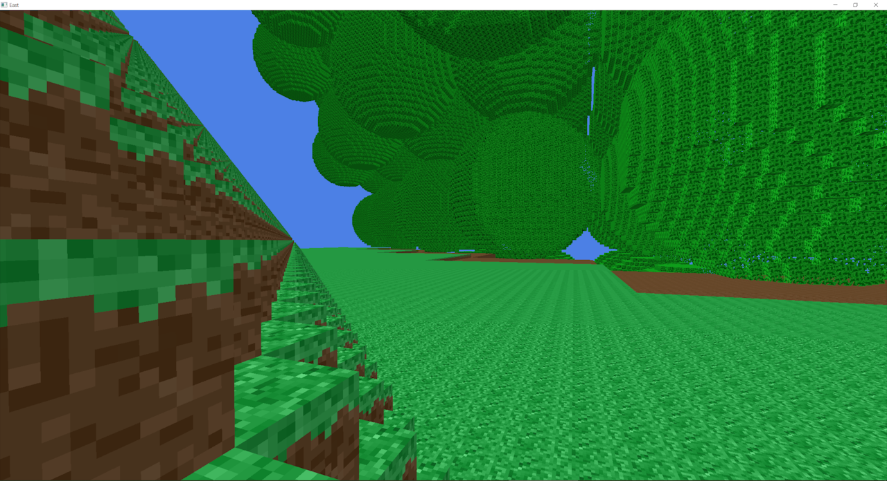
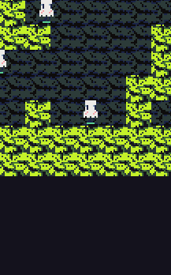
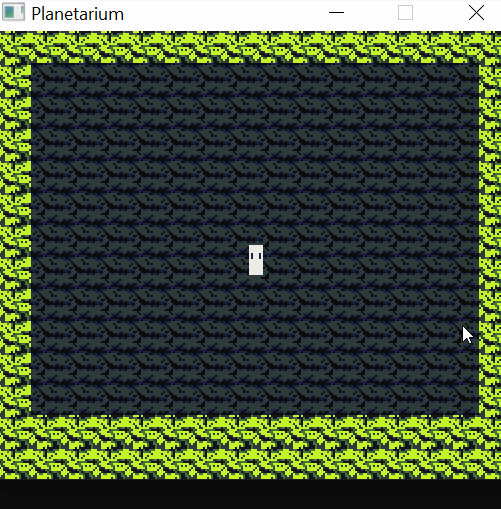

# My Projects

### TODO: jack compiler, library website

I (Liam) am currently in third year at University of Leeds studying a Meng/Bsc in Computer Science with High Performance Computer Graphics and Games Engineering.

I'm currently doing a third year project in High Performance Computer Graphics. Here are some previous and ongoing projects of mine.

## Voxel Game in C with OpenGL 4.5 from scratch on the Win32API

Voxel rendering with chunking, texture arrays and mesh-culling optimisations. My most recent project so it's at an early stage. I intend to add world generation, and need to add a faster chunk mapping system.

[Feel free to peruse the source code to my program here if you like some C programming like me!](source\c_blockgame_september_snippet\src)

Programmed so that the Windows API layer is easy simple to port and swap with a cross-platform library. Using no libraries was great for learning. I implemented my own math library originally ([source here](source/c_blockgame_september_snippet/old_custom_math_src\src_oldcustommath/include/basic_types.h)) but swapped it out for cglm since I could trust its mathematical correctness when debugging rendering errors.

RenderDoc and OpenGL 4.5's debugging API were very useful for GPU debugging, which I needed to do a lot of, especially when building and uploading mesh data for each voxel chunk.

## 2D Platformer Engine in C with Raylib [(please read here :))](2d_c_engine.md)

[Link to the markdown page to read more](2d_c_engine.md) <--
- Custom sprite animation and asset system integrated with the Aseprite pixelart program for a simple fun asset pipeline.
- Integrated tilemap editor, serialising levels with json.

At some point I want to create a full length 2D story/platforming game this way to release on Steam since I love 2D indie games.

- [Level creation and serialisation](2d_c_engine.md#level-creation-and-serialisation)
- [Sprite system loading Aseprite files](2d_c_engine.md#sprite-system-loading-aseprite-files)
- [Easy to work with entity system](2d_c_engine.md#easy-to-work-with-entity-system)

## Compiler for Java-like language 'Jack' into Virtual Machine instructions

TODO

## 2019 Game-Jam Winner: My Precision Platformer for the theme "One Control"

For the theme of "One-Control", in just over a week I made an entry for the January 2019 [Godot-Wild Jam #5](https://itch.io/jam/godot-wild-jam-5/rate/358355)!

<!--  -->

My solo-entry was the result of 8-days of working in the Godot game engine (which has come a long way since 2019). I programmed a weighty one-control movement system, the physics feel responsive and precise as you build momentum. I had lots of fun drawing and animating the pixel art, and meticulously designed the levels perfectly around the mushroom player's movements, requiring skill and precision (taking up peoples afternoons to beat all the levels). I also had success with the sound design, respawn transitions, and adding fractal-brownian-motion fog for atmosphere.

The community behind this jam was really great and gave lots of lovely feedback! ([You can see it here on my entry page for the jam](https://itch.io/jam/godot-wild-jam-5/rate/358355))

### C\# 2018

Game tooling:
Created a game drop down console with command processing. (C\# 2018)

### C programming
2019
- OpenGL testing phong shading-
- Unfinished skeletal animation programming (tried implementing a dual quaternion vertex skinning algorithm)
- Game boy emulator (never finished)
