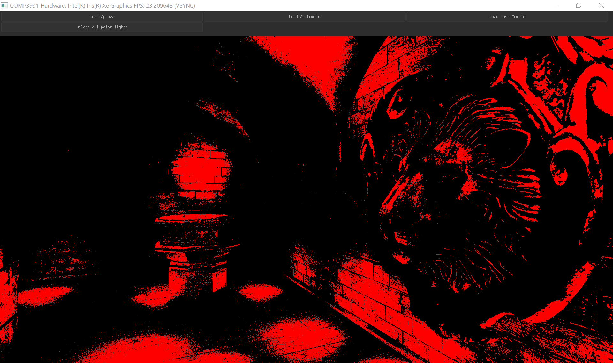

## Thesis "Integrating Linearly-Transformed Cosine based Area Lights into a Clustered Forward Renderer" Progress Update

<!-- 2fps -->
<!--   -->
<!-- 16fps -->
<!--  -->

This 2024 November I've begun my thesis project **"Integrating Linearly-Transformed Cosine based Area Lights into a Clustered Forward Renderer"**, I'm developing my own OpenGL 4.6 renderer for it in C and you can see my progress on my project so far below if I remember to update this page...

#### DONE: Custom C OpenGL 4.6 glTF Physically-Based Renderer (full PBR including dynamic lights, normal mapping, alpha-blending with depth sorting).
Renderer also implements emissive textures, occlusion maps and normal maps. Developed support for way too many glTF files, its became quite a complete renderer.

#### DONE: Clustered Shading for huge performance boost with huge numbers of dynamic point lights.

My pipeline now involves a GLSL compute shader to divide view space into voxel clusters, fed into another compute shader to assign lights to those clusters. Each fragment now only has to compute the lights in its cluster.

<!-- Put these results in 2 column table -->

#### Ongoing: Area lights. Clustered Shading. Area light assignment algorithm. Order-Independant-Transparency.

Area lights are physically-based polygonal lights, and I'm a full renderer that includes a way to assign them to spatial clusters in order to integrate clustered shading which drastically reduces the large GPU throughput that comes from forward rendering lots of lights and thus render scenes with potentially thousands of these lights in real-time.

<!--  -->
<!--  -->

<!--  -->
<!--  -->

Early version^

